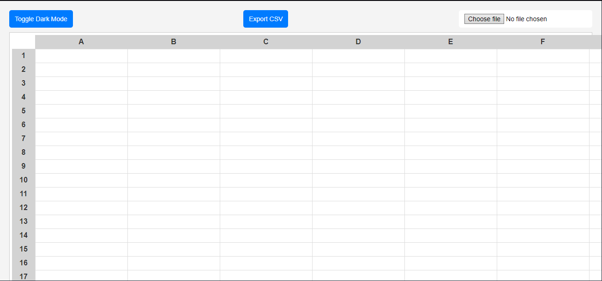

# Functional Programming Spreadsheet

A dynamic, lightweight spreadsheet built with vanilla JavaScript and modern CSS. This project demonstrates advanced functional programming techniques, real-time formula evaluation, CSV import/export capabilities, and a sleek user interface with a dark mode toggle. It is designed to showcase clean, modular code and innovative features for a full-featured web application.



## Table of Contents

- [Features](#features)
- [Demo](#demo)
- [Installation](#installation)
- [Usage](#usage)
- [Code Structure](#code-structure)
- [Technologies Used](#technologies-used)
- [Future Enhancements](#future-enhancements)
- [License](#license)

## Features

- **Dynamic Formula Evaluation:**  
  - Supports arithmetic operations (`+`, `-`, `*`, `/`) with proper operator precedence.
  - Evaluates cell formulas dynamically and supports custom spreadsheet functions such as `sum`, `average`, `median`, `min`, `max`, and `stddev`.

- **CSV Import/Export:**  
  - Easily import and export spreadsheet data in CSV format.

- **Dark Mode Toggle:**  
  - Switch between light and dark themes with a simple click, enhancing user accessibility.

- **Responsive & Modern UI:**  
  - Clean, minimalistic design with smooth CSS transitions.
  - Designed with functional programming principles and modular JavaScript for easy maintenance and scalability.

## Demo

[Live Demo](https://mduduzindlovu-dev.github.io/SpreadSheet/)

## Installation

To run the application locally:

1. **Clone the repository:**

   ```bash
   git clone https://github.com/MduduziNdlovu-dev/SpreadSheet.git
   cd spreadsheet

# Usage

### Open `index.html` in Your Browser

You can simply open the `index.html` file in your favorite browser or use a lightweight web server (e.g., [Live Server](https://marketplace.visualstudio.com/items?itemName=ritwickdey.LiveServer) in VSCode).  
No additional build steps or dependencies are required.

### Formula Input

Enter formulas in any cell by starting with an equals sign (`=`). The formula parser supports basic arithmetic as well as custom functions.  
_Example:_  =sum(1,2,3) =A1+B2


### CSV Operations

Use the toolbar buttons to export the current spreadsheet to CSV or import CSV data into the grid.

### Dark Mode

Click the **"Toggle Dark Mode"** button in the toolbar to switch between light and dark themes.

---

# Code Structure

The project is structured to showcase modular and clean code. Key files include:

- **`index.html`**  
  Contains the basic layout and markup for the toolbar and spreadsheet grid.

- **`styles.css`**  
  Implements modern styling with responsive design, dark mode, and smooth transitions.

- **`script.js`**  
  Contains all JavaScript logic including:

  - **Formula Evaluation:**  
    Uses recursive functions to handle operator precedence and apply spreadsheet functions.
  
  - **UI Interactions:**  
    Event handlers for updating cells, toggling dark mode, and importing/exporting CSV data.
  
  - **Utility Functions:**  
    Includes helper functions like `range()`, `charRange()`, and more for data manipulation.

The code leverages ES6+ features such as arrow functions, template literals, and destructuring to ensure clarity and maintainability.

---

# Technologies Used

- **HTML5 & CSS3:**  
  Used for structure and styling, including responsive design and smooth transitions.

- **JavaScript (ES6+):**  
  Implements functional programming concepts and a modular code structure.

- **Browser APIs:**  
  Utilizes FileReader, Blob, and LocalStorage for CSV operations and theme persistence.

---

# Future Enhancements

- **Enhanced Cell Formatting:**  
  Integrate a toolbar for rich text formatting (e.g., bold, italic, color).

- **Drag-and-Drop:**  
  Implement drag-and-drop functionality to move cells or ranges.

- **Advanced Formulas & Custom Functions:**  
  Allow users to define their own functions and macros.

- **Unit & Integration Tests:**  
  Add automated tests using frameworks like Jest and Cypress for higher code reliability.

---

# License

This project is licensed under the **MIT License**.


